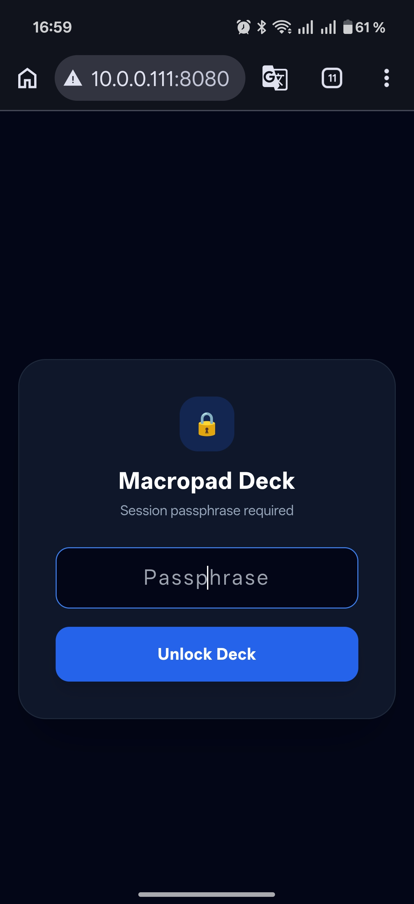
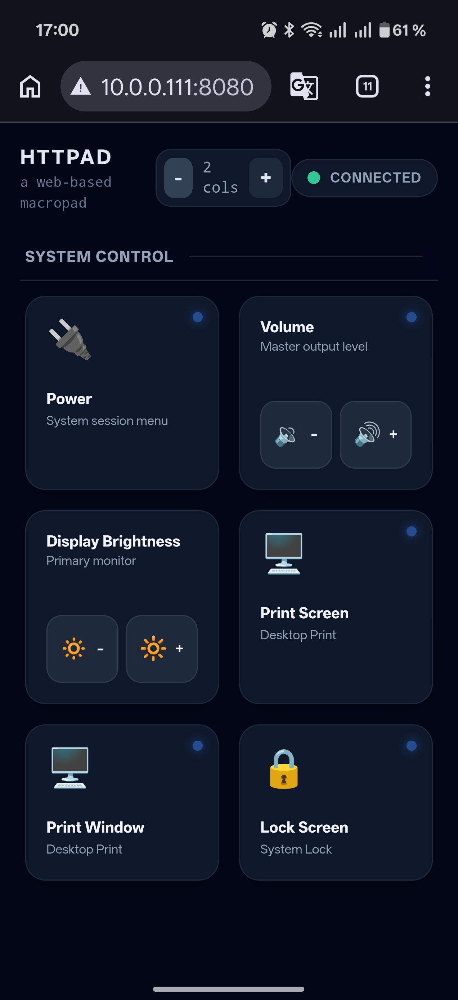
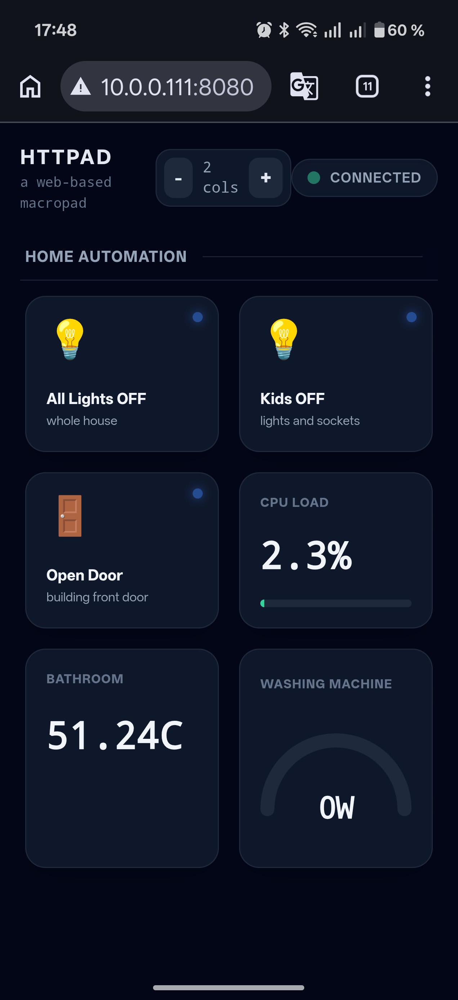
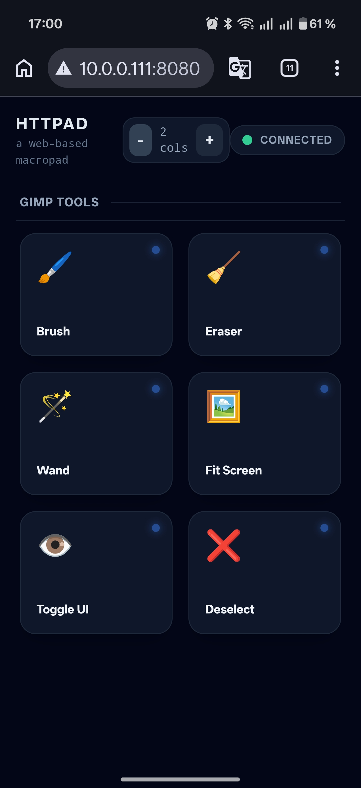

# HTTPAD

A simple macropad inspired by the many hardware implementations out
there.

Macropads are those nifty little kaypads, you plug into your computer
and use to simplify and speed-up the interaction with your
applications or desktop.  They offer a better tactile experience than
an on-screen widget -- real mechanical switches and knobs.  They are
quite flexibile -- you can assign any action or macro (hence the name)
to keys or knobs.  But, unless you want to invest in a top of the
range contraption, that would set you back hundreds of quid and
requires proprietary software to control and configure, they won't be
that practical or intuitive.

The hardware implementations out there don't offer much in terms of
visual feedback.  Usually, the user needs to write on the key caps
what they do, once she has finished their painful configuration
(QMK/Via), that is.  As for visual feedback, the most she can enjoy is
some dumb colour show, assuming the macropad offers RGB backlighting.

Sure, Emacs users may not see the point in such investement (Emacs =
Editor MACroS), but Gimp, Lightroom or most DAW users know the pain.

HTTPAD compromises on the tectile experience to offer a better visual
one.  Not to mention, cheaper.

This app strives to imitate such macropads on a mobile device you
already own.  Were you wondering what to do with that old mobile
phone, sitting around in a drawer?  Now you can turn it into a
macropad with HTTPAD.


## Installation

Download from https://github.com/fourteatoo/httpad

Compile

    $ lein uberjar
   
Copy the uberjar and the trampoline shell script into your `~/bin` directory.

    $ cp target/httpad-<VERSION>-standalone.jar ~/bin/httpad.jar
	$ cp httpad.sh ~/bin/httpad
	$ chmod 750 ~/bin/httpad

## Configuration

Before you can do anything with it, HTTPAD needs a configuration file.
That would be `~/.htppad`.  In this file you configure which port you
want to use and what buttons to display.

The following is an example (and just an example):

```clojure
;; -*- EDN -*-
{:port 8080
 :auth-token "password"
 :mqtt {:host "myserver"
        :port 1883
        :topics {"shellies/shellyswitch25-123456789098/temperature" :bathroom-temperature
                 "tele/home/wms03/SENSOR" {[:ENERGY :Power] :washing-machine}}}
 :sections [{:id :system
             :title "System Control"
             :buttons [{:id :power-menu
                        :title "Power"
                        :desc "System session menu"
                        :icon "🔌"
                        :cmd "xdotool key XF86PowerOff"}
                       {:id :mute
                        :type :stepper
                        :title "Volume"
                        :desc "Master output level"
                        :cmd "xdotool key XF86AudioMute"
                        :actions [{:id :vol-down :icon "🔉" :label "-"
                                   :cmd "xdotool key XF86AudioLowerVolume"}
                                  {:id :vol-up   :icon "🔊" :label "+"
                                   :cmd "xdotool key XF86AudioRaiseVolume"}]}
                       {:id :display-brightness
                        :type :stepper
                        :title "Display Brightness"
                        :desc "Primary monitor"
                        :actions [{:id :bright-down :icon "🔅" :label "-"
                                   :cmd "xdotool key XF86MonBrightnessDown"}
                                  {:id :bright-up   :icon "🔆" :label "+"
                                   :cmd "xdotool key XF86MonBrightnessUp"}]}
                       {:id :print-screen
                        :title "Print Screen"
                        :desc "Desktop Print"
                        :icon "🖥️"
                        :cmd "xdotool key Print"}
                       {:id :print-window
                        :title "Print Window"
                        :desc "Desktop Print"
                        :icon "🖥️"
                        :cmd "xdotool key shift+Print"}
                       {:id :lock-screen
                        :title "Lock Screen"
                        :desc "System Lock"
                        :icon "🔒"
                        :cmd "cinnamon-screensaver-command -l"}]}
            {:id :home
             :title "Home"
             :buttons [{:id :all-lights-off
                        :title "All Lights OFF"
                        :desc "whole house"
                        :icon "💡"
                        :cmd {:type :mqtt
                              :topic "macro/all-lights-off"}}
                       {:id :all-kids-off
                        :title "Kids OFF"
                        :desc "lights and sockets"
                        :icon "💡"
                        :cmd {:type :mqtt
                              :topic "macro/all-kids-off"}}
                       {:id :open-door
                        :title "Open Door"
                        :desc "front door"
                        :icon "🚪"
                        :cmd {:type :mqtt
                              :topic "macro/open-door"}}
                       {:id :cpu-stat
                        :type :bar
                        :title "CPU LOAD"
                        :metric-key :cpu-load
                        :levels {0 :ok 75 :warning 90 :critical}}
                       {:id :bathroom-stat
                        :type :metric
                        :unit "C"
                        :title "Bathroom"
                        :metric-key :bathroom-temperature}
                       {:id :washing-stat
                        :type :gauge
                        :unit "W"
                        :title "Washing machine"
                        :metric-key :washing-machine
                        :levels {0 :ok 300 :warning 1000 :critical}}]}
            {:id :gimp
             :title "GIMP Tools"
             :window-class "Gimp"
             :buttons [{:id "tool-brush"
                        :title "Brush"
                        :icon "🖌️"
                        :cmd "xdotool key p"}
                       {:id "tool-eraser"
                        :title "Eraser"
                        :icon "🧹"
                        :cmd "xdotool key Shift+E"}
                       {:id "tool-select"
                        :title "Wand"
                        :icon "🪄"
                        :cmd "xdotool key u"}
                       {:id "view-fit"
                        :title "Fit Screen"
                        :icon "🖼️"
                        :cmd "xdotool key Ctrl+Shift+J"}
                       {:id "view-tab"
                        :title "Toggle UI"
                        :icon "👁️"
                        :cmd "xdotool key Tab"}
                       {:id "select-none"
                        :title "Deselect"
                        :icon "❌"
                        :cmd "xdotool key Ctrl+Shift+A"}]}]}
   
```

## Usage

HTTPAD is meant to be run from your `.xprofile` at the login.  It
listens to the port you have configured for connections from any
Androi/iOS device you have dedicated to the purpose.  Start it simply
doing:

    $ httpad

From your mobile device connect to http://yourcomputer:port/.  You
should be asked for an access password.



If you enter what you have configured in your `~/.httpad` a button
grid will appear.



At the top you can configure how big you wish to see your buttons.
Swiping to the left you can see the next section.



(yes, it is that hot inside the Shelly case)

and the next



for as many as you configured.

### Context awareness

HTTPAD can be made context aware.  That is, HTTPAD will scroll to the
relevant section whenever it detects that you have changed window
focus on your desktop.  See the `:window-class` of each `:section`.
Example:

```EDN
{:sections [{:id :gimp
             :title "GIMP Tools"
             :window-class "gimp"
             :buttons [...]}
            {:id :darktable
             :title "Photo Editing"
             :window-class "darktable"
             :buttons [...]}
            {:id :audacity
             :title "Audio Editing"
             :window-class "Audacity"
             :buttons [...]}]
 ...}
```

With such configuration, whenever you focus your Gimp window, HTTPAD
will also switch to the Gimp section.  When you focus the Darktable
window, HTTPS will also switch to the Darktable section.  And so on.


## Options

    $ httpad -h

	usage: httpad [option] ...
	  -b, --launch-ui       Open the UI automatically in the browser
	  -c, --config FILE     Use FILE as configuration instead of ~/.httpad
	  -p, --port PORT       Port number
	  -v, --verbose      0  Increase logging verbosity
	  -h, --help            Show this

### Bugs

To be expected.


## License

Copyright © 2026 Walter C. Pelissero <walter@pelissero.de>

This program and the accompanying materials are made available under the
terms of the Eclipse Public License 2.0 which is available at
http://www.eclipse.org/legal/epl-2.0.

This Source Code may also be made available under the following Secondary
Licenses when the conditions for such availability set forth in the Eclipse
Public License, v. 2.0 are satisfied: GNU General Public License as published by
the Free Software Foundation, either version 2 of the License, or (at your
option) any later version, with the GNU Classpath Exception which is available
at https://www.gnu.org/software/classpath/license.html.
